  

  

---

## About Me

<table width="100%" border="0" cellpadding="10" cellspacing="0">
  <tr>
    <td width="58%" valign="middle" style="padding-right: 20px; line-height: 1.6;">
      

        I'm <strong>Nicoleta</strong>, a driven developer and creator who thrives at the intersection of technical logic and creative design.
      

      

        For me, programming isn't just about writing code — it's about the fulfillment of building something impactful and contributing to meaningful solutions. I pair an analytical mindset with a strong creative foundation (I love to draw!), which lets me design and develop software that is both structurally sound and visually intuitive.
      

      

        Outside of coding, I'm committed to continuous personal growth — running, optimizing my systems, reading, and studying psychology to better understand human connection and product strategy. One goal every day: outgrow who I was yesterday.
      

      <table border="0" cellpadding="4" cellspacing="0">
        <tr><td valign="top"><strong>Building</strong></td><td>&nbsp;a production-ready project portfolio</td></tr>
        <tr><td valign="top"><strong>Learning</strong></td><td>&nbsp;PHP development and architecting robust Java applications</td></tr>
        <tr><td valign="top"><strong>Ask me about</strong></td><td>&nbsp;Java, C# object-oriented design, or merging UI/UX with clean code</td></tr>
      </table>
    </td>
    <td width="42%" valign="middle" align="center">
      
       
      <table border="0" cellpadding="0" cellspacing="0" style="border: none; background: transparent; margin: 0 auto;">
        <tr style="border: none; background: transparent;">
          <td align="center" style="border: none; padding: 0 0 8px 0;">
            

              LeetCode &#8212; Nicoleta_cpp &nbsp;&#183;&nbsp; 304+ solved
            

          </td>
        </tr>
        <tr style="border: none; background: transparent;">
          <td align="center" style="border: none; padding: 0;">
            
          </td>
        </tr>
      </table>
    </td>
  </tr>
</table>

---

## Tech Stack & Tools

<table align="center" width="100%">
  <tr>
    <td align="center" width="140"><strong>Languages</strong></td>
    <td>
      
      
      
      
      
    </td>
  </tr>
  <tr>
    <td align="center"><strong>Backend</strong></td>
    <td>
      
      
      
    </td>
  </tr>
  <tr>
    <td align="center"><strong>Frontend</strong></td>
    <td>
      
      
      
      
    </td>
  </tr>
  <tr>
    <td align="center"><strong>Desktop</strong></td>
    <td>
      
      
    </td>
  </tr>
  <tr>
    <td align="center"><strong>Databases</strong></td>
    <td>
      
      
      
    </td>
  </tr>
  <tr>
    <td align="center"><strong>Design</strong></td>
    <td>
      
      
      
      
    </td>
  </tr>
  <tr>
    <td align="center"><strong>Tools & OS</strong></td>
    <td>
      
      
      
    </td>
  </tr>
</table>

---

## Featured Projects

  
  
   
  

---

## GitHub Analytics

  
  
  

  

---

## Certificates & Achievements

  
  
  

---

  

