  

---

## 🛠️ About Me

<table width="100%">
  <tr>
    <td width="60%" valign="top">
      
Hey there! 👋 I'm <strong>Nicoleta</strong>

      
For me, programming isn't just about writing code—it's about the fulfillment of building something impactful and contributing to meaningful solutions. I pair an analytical mindset with a strong creative foundation, allowing me to design and develop software that is both structurally sound and visually intuitive.

      
Outside of coding, I am deeply committed to continuous personal growth. Whether I'm running, optimizing my systems, reading self-help books, or studying psychology to better understand human connection and product strategy, I approach every day with one goal: to outgrow who I was yesterday.

      <ul>
        <li>🚀 <strong>I’m currently working on:</strong> Building a robust, production-ready project portfolio.</li>
        <li>🌱 <strong>I’m currently learning:</strong> PHP development and architecting robust Java applications.</li>
        <li>💬 <strong>Ask me about:</strong> Java programming, C# object-oriented design, or merging UI/UX with clean code.</li>
      </ul>
    </td>
    <td width="40%" valign="center" align="center">
      
    </td>
  </tr>
</table>

---

## 💻 Tech Stack & Tools

  <!-- Programming Languages -->
  
  
  
  
  
  
  
  
  
  
  
   | 
  <!-- Databases -->
  
  
  
   | 
  <!-- Design Tools -->
  
  
  
  
  
  
  
   | 
  <!-- OS -->
  

---

## 📊 GitHub Analytics

  
  
  

---

## 🎯 Just for Fun

  

