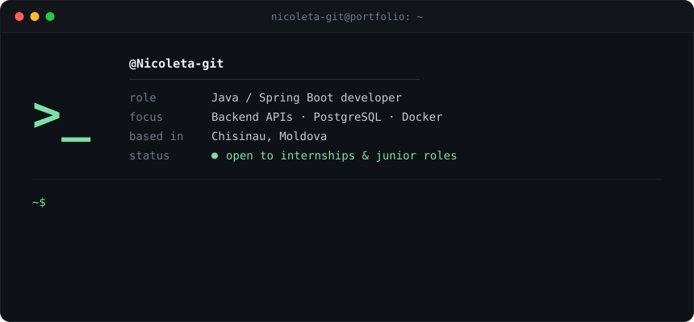

# @Nicoleta-git

**Java / Spring Boot developer** &nbsp;·&nbsp; Chisinau, Moldova

Backend APIs, PostgreSQL and Docker. Open to internships and junior backend roles.

  

<picture>
  <source media="(prefers-color-scheme: dark)" srcset="https://raw.githubusercontent.com/Nicoleta-git/Nicoleta-git/output/snake-dark.svg" />
  
</picture>
